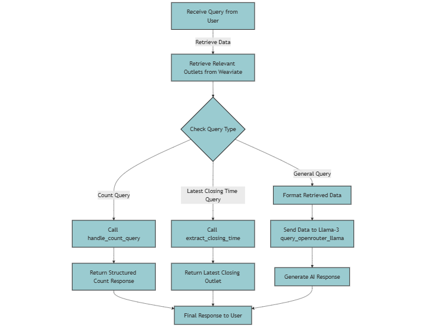
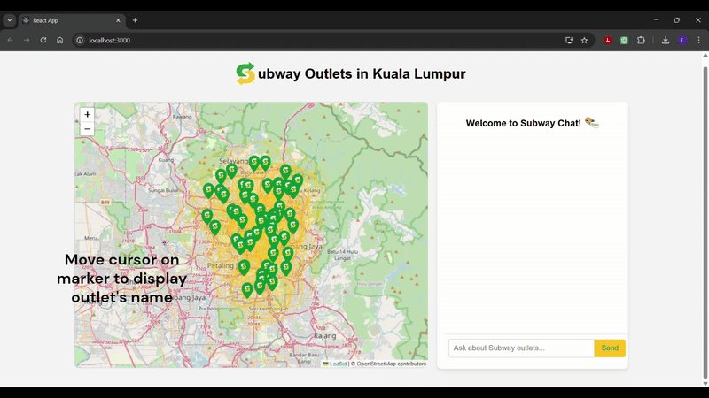
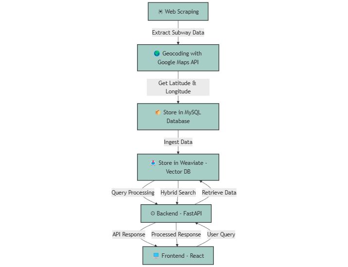

# SUBWAY AICHATBOTS

## Overview
This document provides an overview of the Subway AI Chatbot's architecture, data pipeline, and troubleshooting, focusing on hybrid search, structured query handling, and LLM integration to ensure accurate and reliable responses. For backend, database, and frontend setup, refer to the README.md in their respective directories.

---

## Chatbot Architecture & Query Processing
This chatbot is designed using a hybrid approach that combines structured data retrieval and LLM-powered responses. Unlike traditional RAG (Retrieval-Augmented Generation), which retrieves unstructured text from a vector database and passes it to an LLM, this chatbot directly processes structured queries without relying on an LLM for factual accuracy.

### Key Components
◽Hybrid Retrieval (Vector + Keyword Search)
   - Uses Weaviate’s hybrid search to retrieve relevant Subway outlets based on semantic similarity (vector search) and exact keyword matches (filtering).
   - This allows it to retrieve structured outlet details (e.g., addresses, operating hours) with high accuracy.

◽Structured Query Handling (Without RAG)
   - Instead of passing all retrieved data to LLaMA 3, the chatbot processes structured queries separately:
      - Counting outlets: Uses handle_count_query() to return an exact count.
      - Sorting by closing time: Uses extract_closing_time() and convert_to_24_hour() to normalize and compare operating hours.
   - These queries are resolved without using the LLM, preventing hallucinations.

◽ LLM for Open-Ended Queries Only
   - LLaMA 3 is only used when natural language understanding is required (e.g., “Tell me about Subway in Bangsar”).
   - The chatbot formats retrieved outlet details and constructs a structured prompt before sending it to LLaMA 3.

◽ Preventing Hallucination
   - The chatbot only sends relevant, pre-processed data to LLaMA 3, instead of raw retrieval results.
   - This ensures accurate structured responses while still allowing flexibility for general queries.

<b>Query Processing Workflow For Retrieving and Responding To User Queries</b>

  

 

<b>Demonstration of the Subway AI Chatbot and Interactive Map</b>

  

---

Below diagram represents the data pipeline for the Subway AI Chatbot, showing the flow from data extraction and storage to processing and user interaction.

<b>End-to-End Data Flow for Chatbot</b>

  

---

## Issue & Troubleshooting
### Webscrapping
🛑 **Issue**
- Only the first `
` inside `
` was extracted, so the rest of the operating hours were missing because they were inside a nested `
` container, not directly under `
`.

🛠️ **Troubleshooting & Fix**
- Extracted the full content inside `
` using Selenium.
- Used `BeautifulSoup` to parse the extracted HTML and find all `
` elements inside it.
- Removed empty and irrelevant `
` elements, like "Find out more," using `BeautifulSoup` filtering.
- Separated address and operating hours (first `
` is the address).
- Merged multi-line operating hours if they were split across different `
` elements.
- Formatted the extracted data into a clean, structured response using `BeautifulSoup` processing.

---

### VectorDatabase
🛑 **Issue**
- Pinecone was initially used as the vector database to handle semantic queries for the chatbot. However, Pinecone is optimized for unstructured text search using embeddings and does not natively support filtering structured data (e.g., outlet names, addresses, and operating hours).
- This limitation made it difficult to retrieve precise results when handling structured queries, sometimes causing hallucinations or incorrect responses when trying to match specific locations or business hours.

🛠️ **Troubleshooting & Fix**
- Weaviate was chosen as a replacement because it supports both vector search (semantic similarity) and keyword-based filtering, making it more suitable for handling both structured and unstructured queries.
- This change allows the chatbot to filter by city, outlet name, or specific attributes while still leveraging semantic search for conversational queries.
- However, Weaviate’s free Sandbox tier is available for only 14 days, making it more suitable for learning and prototyping rather than long-term production use.

---

### Inaccurate Responses Due to LLM Model Limitations in Handling Structured Data
🛑 **Issue**
- When users asked “How many outlets are located in Bangsar?”, the chatbot sometimes returned incorrect numbers because:
   - LLaMA 3 is a language model, not a database—it cannot perform exact counting.
   - Weaviate retrieves a limited subset of records, causing LLaMA 3 to estimate the count instead of providing an exact answer.
   - LLMs can hallucinate when handling numeric queries, leading to inconsistent responses.

🛠️ **Troubleshooting & Fix**
- To ensure accuracy, the chatbot now manually processes structured queries instead of relying on LLaMA 3.
- Implemented handle_count_query to directly count the number of outlets based on location.
- Retrieves relevant outlets from Weaviate before processing the count.
- Filters and matches location names accurately, preventing miscounts.
- Returns the exact count without using LLaMA 3, ensuring a reliable response.

🛑 **Issue**
- When users ask “Which Subway outlet closes the latest?”, the chatbot sometimes returns incorrect results because:
   - LLaMA 3 cannot sort operating hours correctly since they are stored as text in various formats.
   - Some outlets have multiple closing times, such as different hours for weekdays, weekends, and public holidays, making it harder to determine the latest closing time.
   - LLaMA 3 hallucinates responses, returning inconsistent results that do not answer the query accurately.

🛠️ **Troubleshooting & Fix**
- To resolve this issue, two functions, convert_to_24_hour(time_str) and extract_closing_time(hours_text), were added to properly process closing times before sorting. These functions ensure the chatbot:
   - Detects if the query is about closing times and determines the user's intent.
   - Retrieves relevant outlets from Weaviate using hybrid search.
   - Standardizes time formats to a 24-hour format for accurate comparison.
   - Extracts and processes operating hours, handling multiple closing times and public holiday variations.
   - Identifies the latest closing outlet and returns an accurate response, without relying on LLaMA 3.

---

## Tools & Technologies Used  

#### Data Collection & Processing
- **Web Scraping** – Extracts Subway outlet data from [Subway Malaysia](https://subway.com.my/find-a-subway).  
- **Google Maps API** – Converts outlet addresses into latitude & longitude for mapping.  
- **MySQL Database** – Stores structured details such as outlet names, addresses, and operating hours.  

#### Data Storage & Retrieval
- **Weaviate (Vector Database)** – Supports hybrid search using vector embeddings and keyword filtering.  
- **Hybrid Search** – Enhances data retrieval by combining semantic and structured search capabilities.  

#### Backend Development
- **FastAPI** – Provides API endpoints for chatbot queries and data retrieval.  
- **OpenRouter API** – Enables Llama-3 access for generating natural language responses.  
- **Query Handling Functions** – Extracts structured responses (e.g., counting outlets, latest closing times).  

#### AI Model & Query Processing
- **Llama-3 (via OpenRouter)** – Handles general chatbot queries requiring natural language understanding.  
- **Structured Query Handling** – Separates structured queries from AI-generated responses to prevent hallucinations.  

#### Frontend Development
- **React** – Builds an interactive UI for searching and displaying Subway outlet information.  
- **Map Integration** – Retrieves geolocation data from MySQL to visualize outlets.  

---

## **FUTURE IMPROVEMENTS**  

Currently, the chatbot only returns a single outlet when answering queries like: *"Which Subway outlet closes the latest?"*

#### **Expected Response:**  
> "The latest closing Subway outlets close at 10:30 PM. These outlets include:  
> - **Subway Sri Gombak** (Closes at 10:30 PM every day)  
> - **Subway Aeon Taman Maluri** (Closes at 10:30 PM on Friday & Saturday)"

#### **Current Issue:**  
- The chatbot only returns one outlet (e.g., *"Subway Sri Gombak"*) even when multiple outlets have the latest closing time but on different days.  

#### **Cause:**  
- The logic currently does not account for outlets with different closing times on specific days.  
- If an outlet closes the latest only on certain days, it gets excluded from the response.  

#### 🛠 **Proposed Fix**
- Update the `extract_closing_time()` function to identify all outlets that have the latest closing time, even if they differ based on the day of the week.  
- Modify how results are grouped and formatted ensuring outlets with variable closing times are correctly included in the response.

---

## Documentation
[Weaviate Documentation](https://weaviate.io/developers/weaviate)
 
[OpenRouter Documentation](https://openrouter.ai/docs/quickstart)
